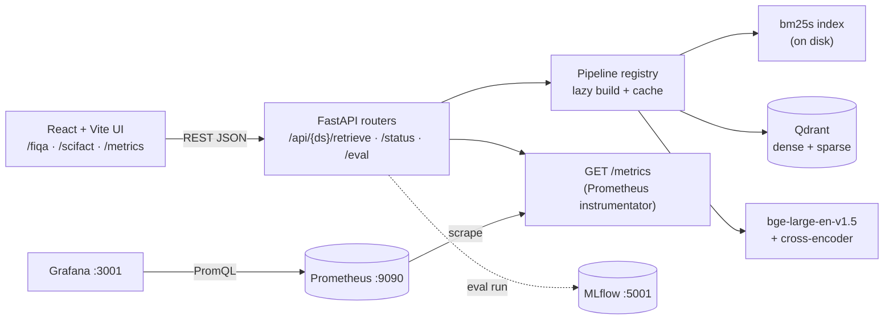
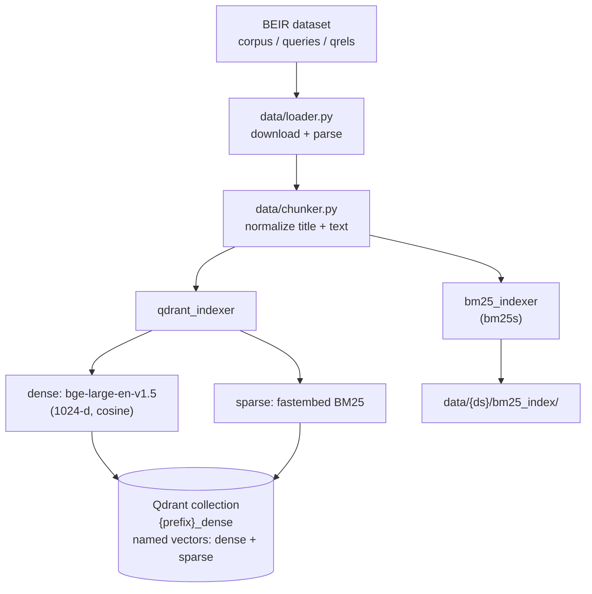
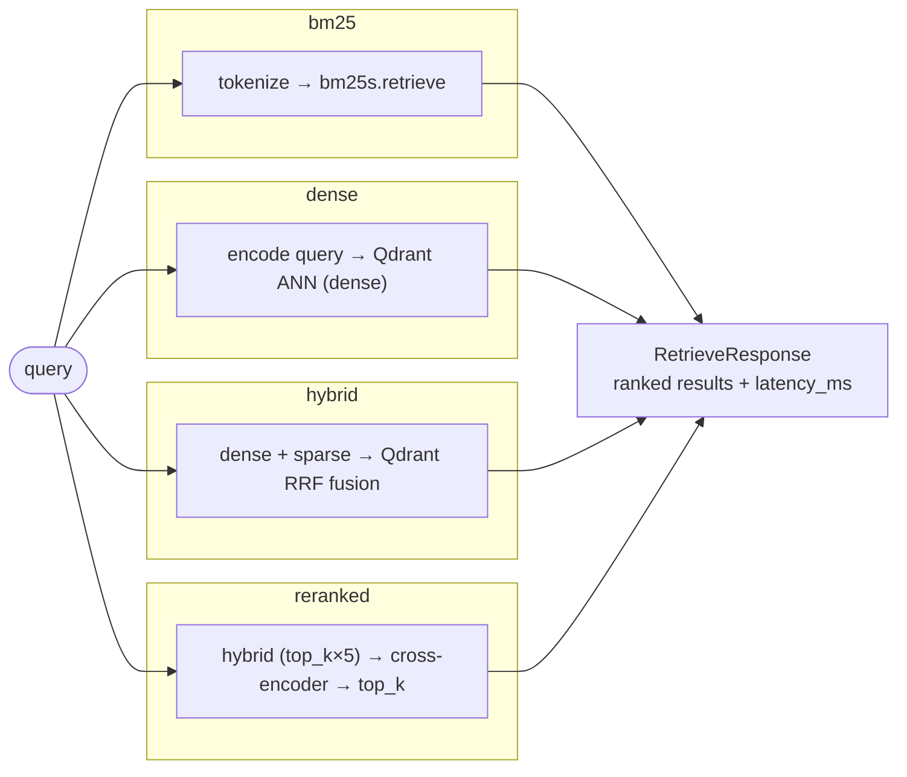
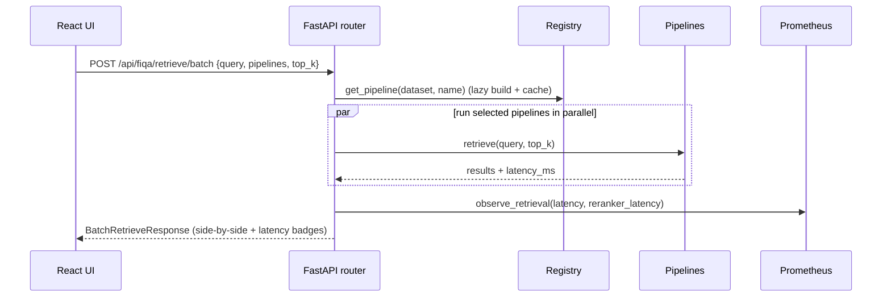
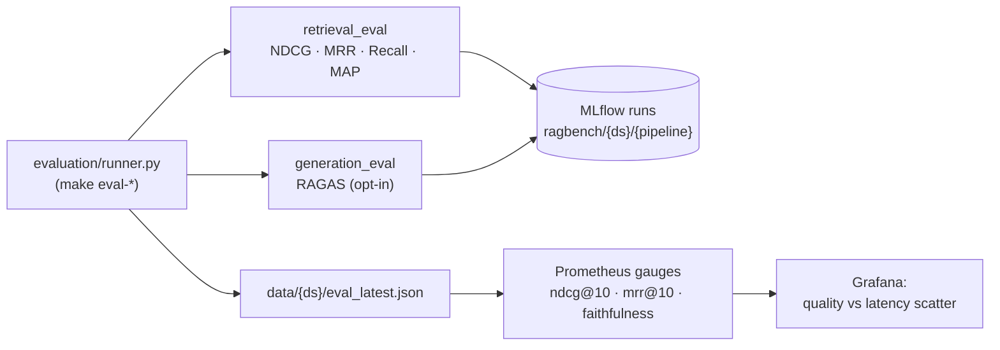

# RAGBench

> A production retrieval-strategy benchmarking platform. Same production patterns as
> [mlserve](#) (FastAPI · Prometheus · Grafana · k6 · HuggingFace) — but instead of
> comparing two inference runtimes, it compares **four retrieval pipelines** on the
> same corpus and queries. The delta is the pipeline.

**Stack:** Qdrant · FastAPI · React · BEIR metrics · RAGAS · MLflow · Prometheus / Grafana

---

## The four pipelines

| Pipeline   | Strategy                          | Expected trade-off                         |
|------------|-----------------------------------|--------------------------------------------|
| `bm25`     | Sparse lexical (`bm25s`)          | Fastest; best on keywords, misses semantics |
| `dense`    | Single-vector ANN (`bge-large`)   | Semantic understanding; slower indexing     |
| `hybrid`   | BM25 + Dense via Qdrant RRF fusion | Best quality/latency balance                |
| `reranked` | Hybrid + cross-encoder reranker   | Highest quality; +60–120 ms                 |

Identical queries, identical corpus, four strategies → measurable deltas in
**quality** (NDCG@10, MRR@10, Recall@10) and **latency** (p50/p95/p99). Generation
quality is measured separately with **RAGAS**. Everything feeds Prometheus; Grafana
renders the side-by-side dashboard whose thesis chart is *quality vs latency*.

---

## Quickstart

```bash
# 1. Install (core). Add the RAGAS extra for generation eval.
make install                 # uv sync
make install-ragas           # uv sync --extra ragas --extra dev

# 2. Bring up Qdrant + MLflow + Prometheus + Grafana (+ the app)
make docker-up               # or: docker compose up --build

# 3. Index a dataset (SciFact is fast; FiQA takes 8–12 min)
make index-scifact

# 4. Run the API locally (without Docker)
make serve                   # http://localhost:8080  (docs at /docs)

# 5. Evaluate + log to MLflow, then view the dashboard
make eval-scifact
```

Ports: **app** 8080 · **Qdrant** 6333 · **MLflow** 5001 · **Prometheus** 9090 · **Grafana** 3001.

---

## Setup & Getting Started

RAGBench uses [**uv**](https://docs.astral.sh/uv/) to manage the Python
environment and dependencies. `uv` creates and manages a project-local virtual
environment in `.venv/` for you — you rarely need to activate it because
`uv run <cmd>` executes inside that environment automatically.

### 1. Prerequisites

| Tool | Version | Needed for |
|---|---|---|
| Python | 3.11+ | the `ragbench` package |
| uv | latest | dependency + venv management |
| Node.js | 20+ | building the React frontend |
| Docker + Compose | latest | full stack (Qdrant, MLflow, Prometheus, Grafana) |

```bash
# Install uv (macOS / Linux)
curl -LsSf https://astral.sh/uv/install.sh | sh
# (Windows PowerShell)  irm https://astral.sh/uv/install.ps1 | iex
```

### 2. Create the environment & install dependencies

`uv sync` reads `pyproject.toml` + `uv.lock`, creates `.venv/`, and installs
everything in one step:

```bash
uv sync                              # core (serve, index, retrieval eval)
uv sync --extra dev                  # + pytest / ruff (tests & linting)
uv sync --extra ragas --extra dev    # + RAGAS generation eval (LLM judge)
```

Prefer to manage the venv explicitly? That works too:

```bash
uv venv --python 3.11 .venv          # create the virtualenv
source .venv/bin/activate            # Windows: .venv\Scripts\activate
uv pip install -e ".[dev,ragas]"     # editable install with extras
```

### 3. Configure environment variables

```bash
cp .env.example .env                 # then edit as needed
# ANTHROPIC_API_KEY=...  is only required for RAGAS generation eval
```

### 4. Verify the install

```bash
uv run python -c "import ragbench; print('ragbench', ragbench.__version__)"
uv run pytest                        # 22 passed, 3 skipped (heavy pipelines)
```

### 5. Use the venv inside Jupyter notebooks

Add `ipykernel` + JupyterLab to the project env, then register the venv as a
named Jupyter kernel so notebooks can import `ragbench` directly:

```bash
# Add the notebook tooling to the project (writes to pyproject + uv.lock)
uv add --dev ipykernel jupyterlab

# Register THIS project's .venv as a selectable Jupyter kernel
uv run python -m ipykernel install --user \
  --name ragbench \
  --display-name "Python (ragbench)"

# Launch JupyterLab and pick the "Python (ragbench)" kernel from the launcher
uv run jupyter lab
```

Inside a notebook cell you can now do:

```python
from ragbench.config.schema import load_config
from ragbench.retrieval.factory import build_pipeline
from ragbench.common.protocol import RetrieveRequest

cfg = load_config("configs/scifact.yaml")
pipe = build_pipeline("bm25", cfg)          # requires an index (make index-scifact)
pipe.retrieve(RetrieveRequest(query="aspirin cancer", pipeline="bm25", top_k=5))
```

To confirm the kernel is wired to the right interpreter:

```python
import sys; print(sys.executable)   # -> .../ragbench/.venv/bin/python
```

List or remove the kernel later with:

```bash
jupyter kernelspec list
jupyter kernelspec uninstall ragbench
```

---

## Workflow & Pipeline Diagrams

> The diagrams below render natively on GitHub (Mermaid). They map the four
> pipelines, the indexing flow, a live request, and how evaluation feeds the
> Grafana dashboard.

### System architecture (Docker Compose)



### Indexing flow (`make index-*`)



### The four retrieval pipelines



### A live side-by-side request



### Evaluation → observability



### End-to-end build order

```mermaid
flowchart LR
  D1["1 Data<br/>BEIR loader"] --> D2["2 Index<br/>bm25s + Qdrant"]
  D2 --> D3["3 Pipelines<br/>bm25/dense/hybrid/reranked"]
  D3 --> D4["4 Eval<br/>BEIR metrics + MLflow"]
  D4 --> D5["5 Serving<br/>FastAPI routers"]
  D5 --> D6["6 FiQA<br/>primary benchmark"]
  D6 --> D7["7 RAGAS<br/>generation eval"]
  D7 --> D8["8 Observability<br/>Prometheus + Grafana"]
  D8 --> D9["9 Frontend<br/>React side-by-side"]
  D9 --> D10["10 Ops<br/>Compose · k6 · HF Spaces"]
```



---

## Datasets

| | SciFact | FiQA |
|---|---|---|
| Role | Dev / fast iteration | Primary benchmark |
| Corpus | 5,183 passages | 57,638 passages |
| Test queries | 300 | 648 |
| Domain | Scientific claims | Financial QA |

Both use the BEIR format (`corpus.jsonl`, `queries.jsonl`, `qrels/test.tsv`) and are
downloaded automatically on first index.

---

## API

All routes are mirrored under `/api/scifact` and `/api/fiqa`:

| Method & path | Purpose |
|---|---|
| `POST /api/{ds}/retrieve` | Single query, single pipeline |
| `POST /api/{ds}/retrieve/batch` | One query across several pipelines (parallel) |
| `GET  /api/{ds}/status` | Index readiness + stats |
| `GET  /api/{ds}/pipelines` | List pipelines + capabilities |
| `POST /api/{ds}/eval/run` | Trigger an offline eval run → MLflow + gauges |
| `GET  /api/datasets` | Available datasets + example queries |
| `GET  /metrics` | Prometheus scrape endpoint |

```bash
curl -s localhost:8080/api/fiqa/retrieve \
  -H 'content-type: application/json' \
  -d '{"query":"How does dollar cost averaging work?","pipeline":"hybrid","top_k":5}' | jq
```

---

## Repository layout

```
src/ragbench/
  common/      paths, logging, protocol types, service clients
  config/      pydantic config models + YAML loader
  data/        BEIR loader + passage normalization
  indexing/    bm25s + Qdrant index builders, build CLI
  retrieval/   base + bm25/dense/hybrid/reranked pipelines, shared embedder
  evaluation/  BEIR metrics, RAGAS gen eval, MLflow runner
  serving/     FastAPI app, dataset routers, registry, Prometheus metrics
frontend/      React + Vite + Tailwind (two dataset pages, side-by-side grid)
monitoring/    Prometheus config + provisioned Grafana dashboard
load_testing/  k6 scripts
deploy/        HuggingFace Spaces Dockerfile (SciFact-only build)
tests/         pytest suite (pipelines, eval, api)
```

### A note on two spec reconciliations
- **Qdrant collections:** server-side RRF fusion needs the dense and sparse vectors
  in *one* collection, so we store both named vectors inside `{prefix}_dense`
  (matches the spec's hybrid query sample). See `indexing/qdrant_indexer.py`.
- **BGE prefixes:** the BGE v1.5 model card puts the retrieval instruction on the
  *query*, not the passage. We follow the model card for correct scores. See
  `retrieval/embedder.py`.

---

## Evaluation

- **Retrieval:** NDCG@k, MRR@k, Recall@k, Precision@k, MAP@k (trec_eval/BEIR
  definitions, implemented dependency-free in `evaluation/retrieval_eval.py`).
- **Generation (RAGAS, opt-in):** Faithfulness, Answer Relevance, Context Recall,
  Context Precision. Runs on a sample (default 100 queries) with `claude-3-haiku`
  as judge. Requires `--extra ragas` and `ANTHROPIC_API_KEY`.

Every eval run logs one MLflow run per pipeline under `ragbench/{dataset}` and
writes `data/{dataset}/eval_latest.json`, which seeds the Prometheus gauges the
Grafana dashboard reads.

---

## Testing & load testing

```bash
make test          # pytest (pipelines, eval, api)
make load-test     # k6 against local serving
```

The test suite runs without downloading `bge-large`: it builds a tiny bm25s index
over a tuned SciFact-style fixture and exercises the API through it. Dense/hybrid/
reranked tests self-skip when heavy models or Qdrant are unavailable.

---

## Deployment (HuggingFace Spaces)

`deploy/huggingface/Dockerfile` builds the **SciFact** index at image-build time and
runs the app in `HF_SPACE=true` (SciFact-only) mode. FiQA is too large to index at
Spaces build time — see the deploy Dockerfile comments.
