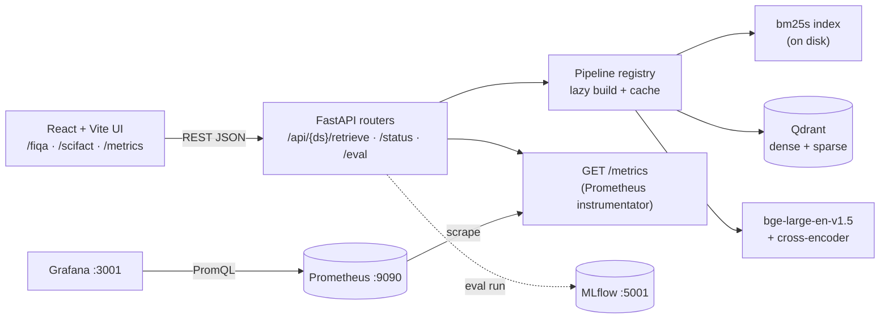
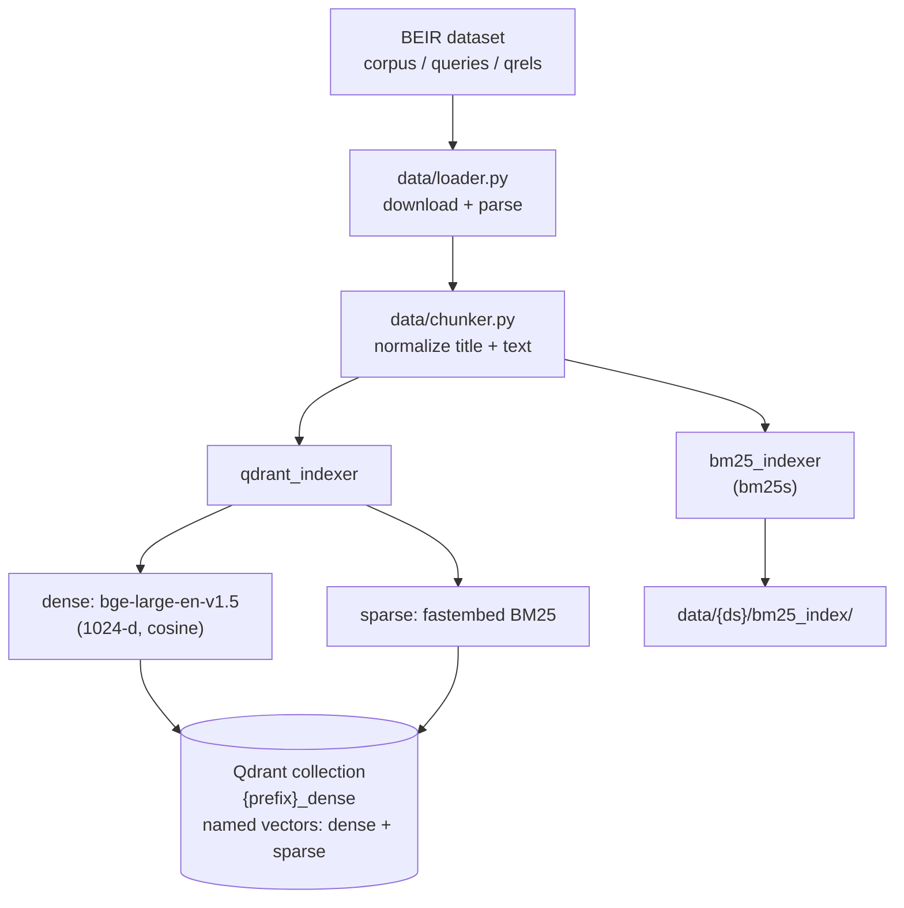
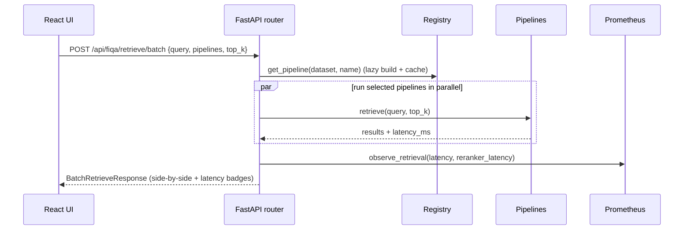
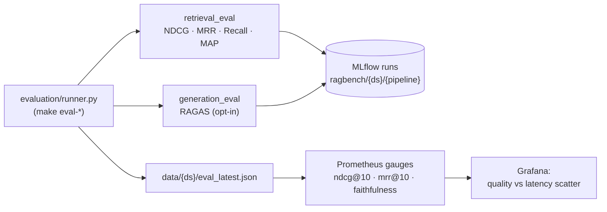

```mermaid
flowchart LR
  D1["1 Data<br/>BEIR loader"] --> D2["2 Index<br/>bm25s + Qdrant"]
  D2 --> D3["3 Pipelines<br/>bm25/dense/hybrid/reranked"]
  D3 --> D4["4 Eval<br/>BEIR metrics + MLflow"]
  D4 --> D5["5 Serving<br/>FastAPI routers"]
  D5 --> D6["6 FiQA<br/>primary benchmark"]
  D6 --> D7["7 RAGAS<br/>generation eval"]
  D7 --> D8["8 Observability<br/>Prometheus + Grafana"]
  D8 --> D9["9 Frontend<br/>React side-by-side"]
  D9 --> D10["10 Ops<br/>Compose · k6 · HF Spaces"]
```

# RAGBench

A platform that runs the **same questions** over the **same documents** with four
different search strategies, then compares quality and speed.

**Pieces involved:** Qdrant (vector database) · FastAPI (the API) · React (the web
UI) · BEIR metrics · RAGAS · MLflow · Prometheus / Grafana

---

## The four search strategies

| Pipeline   | What it does                         | What to expect                              |
|------------|--------------------------------------|---------------------------------------------|
| `bm25`     | Keyword search (`bm25s`)             | Fastest; strong on exact words              |
| `dense`    | Meaning-based search (`bge-large`)   | Finds related ideas; slower to build        |
| `hybrid`   | Keywords + meaning, fused in Qdrant  | Best balance of quality and speed           |
| `reranked` | Hybrid, then a second scoring pass   | Highest quality; adds about 60–120 ms       |

Quality is NDCG@10, MRR@10, and Recall@10. Speed is p50 / p95 / p99 latency.
Answer quality (did the generated reply stay faithful to the passages?) is a
separate, optional step called **RAGAS**. Grafana plots quality against latency.

---

## Start here: pick one way to run it

There are two complete workflows. Follow **one** of them from top to bottom.
Mixing them is what makes the commands look out of order.

| | **Path A — on your computer** | **Path B — everything in Docker** |
|---|---|---|
| You want to | Change the Python code, use notebooks, run tests | Open the app and the dashboards |
| You install | Python, uv, and Docker | Docker only |
| The API runs via | `make serve` on your machine (port 8080) | the `ragbench` container (port 8080) |
| Qdrant runs via | a Docker container you start first | the same `docker compose up` |
| Index command | `make index-scifact` on your machine | `docker compose exec …` inside the container |

**The order that matters:** Qdrant has to be running **before** you build the
vector index. The index command saves a keyword catalog on disk first (that part
always works), then uploads vectors to Qdrant. If Qdrant is not listening on
port 6333, that second half fails with `Connection refused`.

### What each kind of command is for

| You type | It means | Use it when |
|---|---|---|
| `uv sync` | Install this project's Python packages into a private folder, `.venv/` | Once, at the start of Path A. `make install` is the same command. |
| `uv run …` | Run the command that follows using that `.venv` | Path A, for indexing, the API, tests, and evaluation |
| `make <name>` | A short name for a longer command (see the [command map](#command-map)) | Whenever you would rather not type the full `uv run` line |
| `docker compose …` | Start, stop, or run a command inside containers | Path A step that starts Qdrant; all of Path B |

`uv run` already uses `.venv`. You do not need to `source .venv/bin/activate`.

---

## Path A — run the code on your computer

Do these steps in order. Each one depends on the one before it.

You need:

| Tool | Version | Why |
|---|---|---|
| Python | 3.11+ | the application |
| [uv](https://docs.astral.sh/uv/) | latest | installs Python packages into `.venv/` |
| Docker + Compose | latest | runs Qdrant (and MLflow, if you evaluate) |
| Node.js | 20+ | only if you want the web UI in dev mode (step A8) |

Install uv if you do not have it:

```bash
# macOS / Linux
curl -LsSf https://astral.sh/uv/install.sh | sh
# Windows PowerShell:  irm https://astral.sh/uv/install.ps1 | iex
```

### A1. Install the Python packages

From the project folder:

```bash
uv sync
```

That reads `pyproject.toml` and `uv.lock`, creates `.venv/`, and installs
everything the app needs to index, serve, and score retrieval.

Add extras only when you need them:

```bash
uv sync --extra dev                  # pytest and ruff (tests and lint)
uv sync --extra ragas --extra dev    # also RAGAS, the optional answer-quality judge
```

`make install` is `uv sync`. `make install-ragas` is the RAGAS line above.

Check that the package is visible:

```bash
uv run python -c "import ragbench; print('ragbench', ragbench.__version__)"
```

### A2. Create the settings file

```bash
cp .env.example .env
```

Leave `ANTHROPIC_API_KEY` empty for now. Indexing, search, and the retrieval
scores (NDCG, MRR, Recall) do not use it. You fill it in only at step A7, and
only if you want RAGAS.

`QDRANT_URL=http://localhost:6333` in that file is the address Path A uses.
Qdrant will be listening there after the next step.

### A3. Start Qdrant (and MLflow)

Qdrant is a separate program. The Python index command talks to it over HTTP.
Start it now, before any index command:

```bash
docker compose up -d qdrant mlflow
```

- **Qdrant** (port 6333) stores the vectors. Required for `dense`, `hybrid`, and `reranked`.
- **MLflow** (port 5001) stores evaluation runs. Required only for step A7.

Confirm Qdrant is actually up:

```bash
docker compose ps
curl -sf http://localhost:6333/readyz && echo "Qdrant is ready"
```

This step starts **only** those two services, so port 8080 stays free for the
API you start in step A5. The Grafana dashboard is Path B: Prometheus is wired
to the app container, not to this local API.

### A4. Build the search indexes

SciFact is the small set (5,183 passages). Use it first. FiQA is the full
benchmark (57,638 passages, about 8–12 minutes). The first run also downloads
the dataset and the embedding model, so it needs a network connection.

```bash
make index-scifact
```

That is the short form of:

```bash
uv run python -m ragbench.indexing.build --config configs/scifact.yaml
```

The command builds two catalogs:

1. A **keyword index** on disk at `data/scifact/bm25_index/` (no Qdrant needed).
2. A **vector index** inside Qdrant (this is the step that fails if A3 was skipped).

When it finishes you should see both a `bm25s:` line and a `qdrant:` line.

Other dataset and backend choices:

```bash
make index-fiqa          # full benchmark
make index-all           # SciFact, then FiQA

# the same work, written out
uv run python -m ragbench.indexing.build --config configs/fiqa.yaml
uv run python -m ragbench.indexing.build --config configs/scifact.yaml --only bm25
uv run python -m ragbench.indexing.build --config configs/scifact.yaml --only qdrant
uv run ragbench-index --config configs/scifact.yaml
```

`--only bm25` builds the keyword catalog and stops. `--only qdrant` builds the
vector catalog and still requires step A3.

**If you see `Connection refused` (errno 61):** the keyword half may already
have succeeded. Qdrant was not running. Go back to step A3, wait until
`readyz` succeeds, then run the index command again.

### A5. Start the API

```bash
make serve
```

Same command, written out:

```bash
uv run uvicorn ragbench.serving.app:app --host 0.0.0.0 --port 8080 --reload
```

Leave that terminal open. Then visit:

- App docs: http://localhost:8080/docs
- Health of the indexes: http://localhost:8080/api/scifact/status

### A6. Ask a question

In a second terminal:

```bash
curl -s localhost:8080/api/scifact/retrieve \
  -H 'content-type: application/json' \
  -d '{"query":"aspirin colorectal cancer","pipeline":"hybrid","top_k":5}'
```

`pipeline` is one of `bm25`, `dense`, `hybrid`, `reranked`. To compare several
at once:

```bash
curl -s localhost:8080/api/scifact/retrieve/batch \
  -H 'content-type: application/json' \
  -d '{"query":"aspirin colorectal cancer","pipelines":["bm25","hybrid"],"top_k":5}'
```

Leave `pipelines` out of a batch request to run all four.

Switch the dataset by changing both the URL and the config you indexed:
`/api/scifact` goes with `configs/scifact.yaml`, `/api/fiqa` with
`configs/fiqa.yaml`.

### A7. (Optional) Score the results

Start MLflow first if it is not already up (`docker compose up -d mlflow` from
step A3). Retrieval scores need no API key:

```bash
uv run python -m ragbench.evaluation.runner \
  --config configs/scifact.yaml --no-ragas
```

`make eval-scifact` is the same runner **with** RAGAS turned on. For that, do
both of these first:

```bash
uv sync --extra ragas
```

and set `ANTHROPIC_API_KEY=sk-ant-...` in `.env`. RAGAS uses that key as the
answer writer and as the judge. To score a subset of strategies:

```bash
uv run python -m ragbench.evaluation.runner \
  --config configs/fiqa.yaml --pipelines bm25 hybrid --no-ragas --no-mlflow
```

| Flag | Effect |
|---|---|
| `--pipelines a b …` | Score only these (default: `evaluation.pipelines` in the YAML) |
| `--no-ragas` | Skip answer-quality scoring. No API key. |
| `--no-mlflow` | Skip MLflow. Still writes `data/{dataset}/eval_latest.json` |

Runs show up at http://localhost:5001.

### A8. (Optional) Web UI in dev mode

The API from step A5 is enough to search. To work on the React screens:

```bash
make frontend     # http://localhost:5173
```

### A9. (Optional) Jupyter

```bash
uv add --dev ipykernel jupyterlab
uv run python -m ipykernel install --user \
  --name ragbench \
  --display-name "Python (ragbench)"
uv run jupyter lab
```

In the launcher, pick the **Python (ragbench)** kernel. The index from step A4
has to exist before this will retrieve anything:

```python
from ragbench.config.schema import load_config
from ragbench.retrieval.factory import build_pipeline
from ragbench.common.protocol import RetrieveRequest

cfg = load_config("configs/scifact.yaml")
pipe = build_pipeline("bm25", cfg)
pipe.retrieve(RetrieveRequest(query="aspirin cancer", pipeline="bm25", top_k=5))
```

```python
import sys; print(sys.executable)   # .../ragbench/.venv/bin/python
```

```bash
jupyter kernelspec list
jupyter kernelspec uninstall ragbench
```

### A10. Stop the containers when you are done

```bash
docker compose stop qdrant mlflow          # stop them, keep the vectors
docker compose rm -f qdrant mlflow         # remove the containers
# vectors live in the qdrant_storage volume until you delete volumes (Path B)
```

---

## Path B — run the whole stack in Docker

Use this when you want the app, Qdrant, MLflow, Prometheus, and Grafana together,
and you are not editing Python. Docker is the only install. Do the steps in order.

### B1. Settings file

```bash
cp .env.example .env
```

Compose reads `.env` and passes `ANTHROPIC_API_KEY` into the app container.
Leave it empty until you want RAGAS (step B5).

### B2. Start all five services

```bash
docker compose up --build -d
```

`-d` runs them in the background so you can type the next command. Drop `-d`
if you want the logs in this terminal.

`make docker-up` is the same start **without** `-d` (it stays in the foreground).

Wait until the containers are running:

```bash
docker compose ps
```

| Service | URL | What it is |
|---|---|---|
| App + UI | http://localhost:8080 | the search UI |
| API docs | http://localhost:8080/docs | try requests in the browser |
| Qdrant | http://localhost:6333 | vector database |
| MLflow | http://localhost:5001 | evaluation history |
| Prometheus | http://localhost:9090 | raw metrics |
| Grafana | http://localhost:3001 | charts (login `admin` / `admin`) |

The app container talks to Qdrant at `http://qdrant:6333` (set in
`docker-compose.yml`). Your `.env` value `http://localhost:6333` is for Path A,
when the command runs on your machine.

### B3. Build an index inside the app container

A fresh stack has empty indexes, so search returns nothing until this finishes.
`docker compose exec` runs the command **in the container that is already up**,
which can already reach Qdrant:

```bash
docker compose exec ragbench \
  uv run python -m ragbench.indexing.build --config configs/scifact.yaml
```

Use `configs/fiqa.yaml` for the full benchmark (8–12 minutes).

### B4. Ask a question

Open http://localhost:8080, or:

```bash
curl -s localhost:8080/api/scifact/retrieve \
  -H 'content-type: application/json' \
  -d '{"query":"aspirin colorectal cancer","pipeline":"hybrid","top_k":5}'
```

### B5. (Optional) Run an evaluation

```bash
docker compose exec ragbench \
  uv run python -m ragbench.evaluation.runner \
  --config configs/scifact.yaml --no-ragas
```

Results land in MLflow and on the Grafana dashboard. To include RAGAS, set
`ANTHROPIC_API_KEY` in `.env`, restart the app container so it picks the key up
(`docker compose up -d ragbench`), and drop `--no-ragas`.

### B6. Stop

```bash
docker compose down        # stop containers, keep indexes and volumes
docker compose down -v     # also delete stored vectors, metrics, and MLflow data
```

Useful while it is running:

```bash
docker compose logs -f ragbench
docker compose logs -f qdrant
```

---

## Command map

`make` does not do extra work. Each target is one of the commands from Path A
or Path B:

| You want to | Short form | What actually runs |
|---|---|---|
| Install packages | `make install` | `uv sync` |
| Install RAGAS too | `make install-ragas` | `uv sync --extra ragas --extra dev` |
| Start Qdrant + the rest (Path B) | `make docker-up` | `docker compose up --build` |
| Stop that stack | `make docker-down` | `docker compose down` |
| Index SciFact | `make index-scifact` | `uv run python -m ragbench.indexing.build --config configs/scifact.yaml` |
| Index FiQA | `make index-fiqa` | same, with `configs/fiqa.yaml` |
| Index both | `make index-all` | SciFact, then FiQA |
| API on your machine | `make serve` | `uv run uvicorn ragbench.serving.app:app --host 0.0.0.0 --port 8080 --reload` |
| React dev server | `make frontend` | `npm install && npm run dev` in `frontend/` |
| Evaluate SciFact | `make eval-scifact` | `uv run python -m ragbench.evaluation.runner --config configs/scifact.yaml` |
| Evaluate FiQA | `make eval-fiqa` | same, with `configs/fiqa.yaml` |
| Tests | `make test` | `uv run pytest` |
| Load test | `make load-test` | `k6 run load_testing/fiqa_load.js` |

`make help` prints this list from the Makefile.

---

## Reference

### Datasets

Point `--config` at the file for the set you indexed:

```text
configs/scifact.yaml   # small, for trying things out (5,183 passages, 300 queries)
configs/fiqa.yaml      # the benchmark (57,638 passages, 648 queries)
```

`HF_SPACE=true` (HuggingFace Spaces) serves SciFact only.

### Choose which strategies run

Names: **`bm25` · `dense` · `hybrid` · `reranked`**.

- **One request:** `"pipeline": "dense"` on `POST /api/{dataset}/retrieve`.
- **Several at once:** `"pipelines": ["bm25", "reranked"]` on `POST /api/{dataset}/retrieve/batch`.
- **An offline eval:** `--pipelines bm25 hybrid` on the evaluation runner.
- **The default list:** `evaluation.pipelines` in the dataset YAML. The UI checkboxes override it per request.

Trigger an eval from a running API (step A5 or Path B):

```bash
curl -s localhost:8080/api/fiqa/eval/run \
  -H 'content-type: application/json' \
  -d '{"pipelines":["bm25","hybrid"],"with_ragas":false,"background":true}'

curl -s localhost:8080/api/fiqa/eval/latest
```

### Settings in `configs/{dataset}.yaml`

| Key | Purpose |
|---|---|
| `indexing.device` | `cpu` or `cuda` for embedding and reranking |
| `indexing.embedding_model` | dense model (default `BAAI/bge-large-en-v1.5`) |
| `serving.top_k_default` | default number of results |
| `serving.rerank_multiplier` | how many extra hits the reranked pipeline fetches (`top_k × N`) |
| `evaluation.pipelines` | default strategies for eval and the API |
| `evaluation.ragas_sample_size` | how many queries RAGAS scores (controls cost) |
| `evaluation.ragas_llm` | RAGAS judge model (default `claude-3-haiku`) |
| `reranker.model` | cross-encoder used by `reranked` |

### If something fails

| What you see | What to do |
|---|---|
| `Connection refused` while indexing, after a `bm25s:` success line | Qdrant is not up. Path A: redo step A3 and check `curl http://localhost:6333/readyz`. Path B: `docker compose ps` should show `qdrant` running, then rerun step B3. |
| `Address already in use` on port 8080 | Path B's app and `make serve` both use 8080. Stop one of them (`docker compose stop ragbench`, or quit `make serve`). |
| Search returns no hits | The index for that dataset has not been built yet. Run step A4 or B3 for the config that matches the URL (`scifact` or `fiqa`). |
| RAGAS asks for a key or fails on import | `uv sync --extra ragas`, set `ANTHROPIC_API_KEY` in `.env`. Or add `--no-ragas` and skip it. |

---

## Workflow & Pipeline Diagrams

These diagrams show how the pieces connect. The commands you type, and the
order to type them, are in [Path A](#path-a--run-the-code-on-your-computer) and
[Path B](#path-b--run-the-whole-stack-in-docker) above. GitHub renders the
diagrams natively.

### System architecture (Docker Compose)



### Indexing flow (`make index-*`)



### The four retrieval pipelines


### A live side-by-side request



### Evaluation → observability



### How the code is layered

This is the order the software is built in, separate from the steps you run.



---

## Datasets

| | SciFact | FiQA |
|---|---|---|
| Role | Dev / fast iteration | Primary benchmark |
| Corpus | 5,183 passages | 57,638 passages |
| Test queries | 300 | 648 |
| Domain | Scientific claims | Financial QA |

Both use the BEIR format (`corpus.jsonl`, `queries.jsonl`, `qrels/test.tsv`) and are
downloaded automatically on first index.

---

## API

All routes are mirrored under `/api/scifact` and `/api/fiqa`:

| Method & path | Purpose |
|---|---|
| `POST /api/{ds}/retrieve` | Single query, single pipeline |
| `POST /api/{ds}/retrieve/batch` | One query across several pipelines (parallel) |
| `GET  /api/{ds}/status` | Index readiness + stats |
| `GET  /api/{ds}/pipelines` | List pipelines + capabilities |
| `POST /api/{ds}/eval/run` | Trigger an offline eval run → MLflow + gauges |
| `GET  /api/datasets` | Available datasets + example queries |
| `GET  /metrics` | Prometheus scrape endpoint |

```bash
curl -s localhost:8080/api/fiqa/retrieve \
  -H 'content-type: application/json' \
  -d '{"query":"How does dollar cost averaging work?","pipeline":"hybrid","top_k":5}' | jq
```

---

## Repository layout

```
src/ragbench/
  common/      paths, logging, protocol types, service clients
  config/      pydantic config models + YAML loader
  data/        BEIR loader + passage normalization
  indexing/    bm25s + Qdrant index builders, build CLI
  retrieval/   base + bm25/dense/hybrid/reranked pipelines, shared embedder
  evaluation/  BEIR metrics, RAGAS gen eval, MLflow runner
  serving/     FastAPI app, dataset routers, registry, Prometheus metrics
frontend/      React + Vite + Tailwind (two dataset pages, side-by-side grid)
monitoring/    Prometheus config + provisioned Grafana dashboard
load_testing/  k6 scripts
deploy/        HuggingFace Spaces Dockerfile (SciFact-only build)
tests/         pytest suite (pipelines, eval, api)
```

### A note on two spec reconciliations
- **Qdrant collections:** server-side RRF fusion needs the dense and sparse vectors
  in *one* collection, so we store both named vectors inside `{prefix}_dense`
  (matches the spec's hybrid query sample). See `indexing/qdrant_indexer.py`.
- **BGE prefixes:** the BGE v1.5 model card puts the retrieval instruction on the
  *query*, not the passage. We follow the model card for correct scores. See
  `retrieval/embedder.py`.

---

## Evaluation

- **Retrieval:** NDCG@k, MRR@k, Recall@k, Precision@k, MAP@k (trec_eval/BEIR
  definitions, implemented dependency-free in `evaluation/retrieval_eval.py`).
- **Generation (RAGAS, opt-in):** Faithfulness, Answer Relevance, Context Recall,
  Context Precision. Runs on a sample (default 100 queries) with `claude-3-haiku`
  as judge. Requires `--extra ragas` and `ANTHROPIC_API_KEY`.

Every eval run logs one MLflow run per pipeline under `ragbench/{dataset}` and
writes `data/{dataset}/eval_latest.json`, which seeds the Prometheus gauges the
Grafana dashboard reads.

---

## Testing & load testing

```bash
make test          # pytest (pipelines, eval, api)
make load-test     # k6 against local serving
```

The test suite runs without downloading `bge-large`: it builds a tiny bm25s index
over a tuned SciFact-style fixture and exercises the API through it. Dense/hybrid/
reranked tests self-skip when heavy models or Qdrant are unavailable.

---

## Deployment (HuggingFace Spaces)

`deploy/huggingface/Dockerfile` builds the **SciFact** index at image-build time and
runs the app in `HF_SPACE=true` (SciFact-only) mode. FiQA is too large to index at
Spaces build time — see the deploy Dockerfile comments.
